# vibe-kanban

A Kanban board with an agent-friendly API, built for **vibe coding workflows**.

When AI agents work on complex projects, tasks get lost — context windows fill up, conversations compress, and the agent forgets what it was supposed to do next. **vibe-kanban** gives agents (and humans) a shared Kanban board where every task, status change, and blocker is tracked via a simple REST API.

> **TL;DR** — Your agent syncs its TODO list here. You watch progress in real-time. Nothing gets forgotten.

**Built with:** Python (FastAPI) · React (Vite + TypeScript) · Tailwind CSS · SQLite/PostgreSQL · JWT + API Key auth

## Screenshots

### Login
Email/password + Google OAuth. Includes "Forgot password?" flow with email reset link.

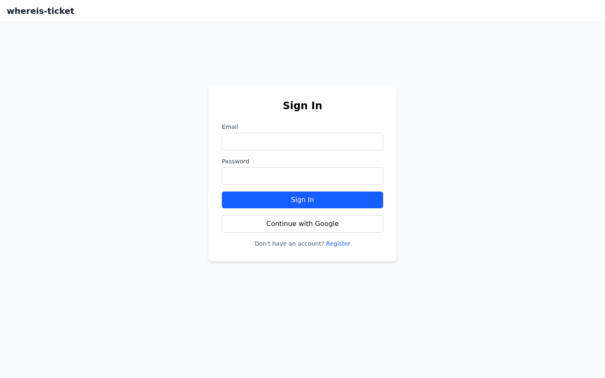

### Forgot Password
Enter your email to receive a password reset link (15-minute expiry).

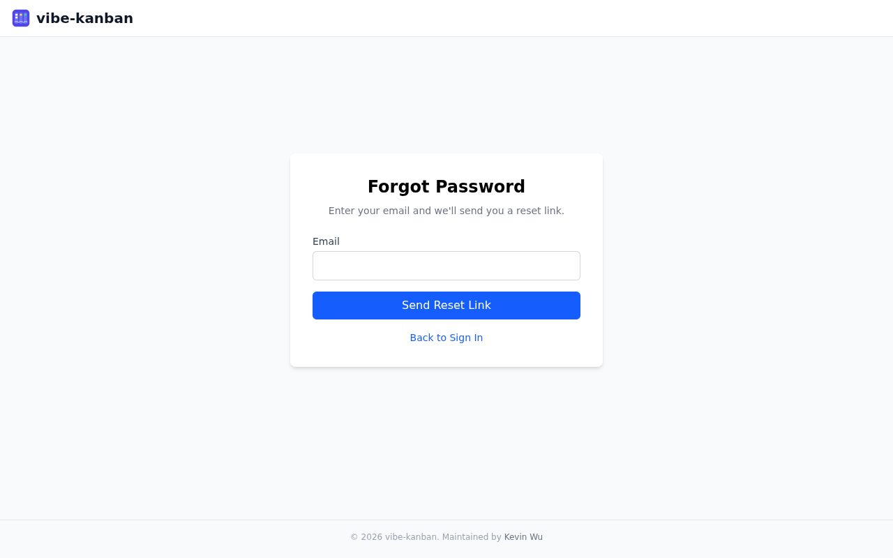

### Projects (API Keys)
Each project gets a unique API key with description, timestamps (created/last used), and self-service revoke/regenerate actions.

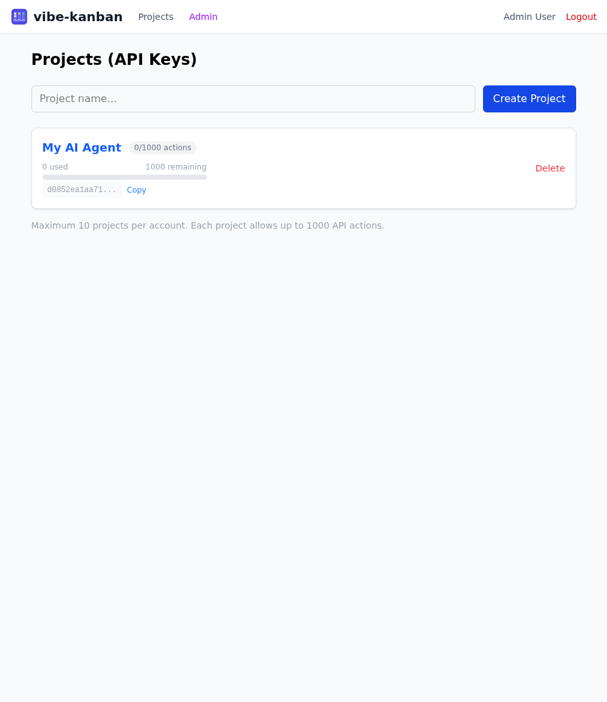

### Kanban Board
Drag-and-drop across 5 columns. Priority color-coding: red = high, yellow = medium, green = low.

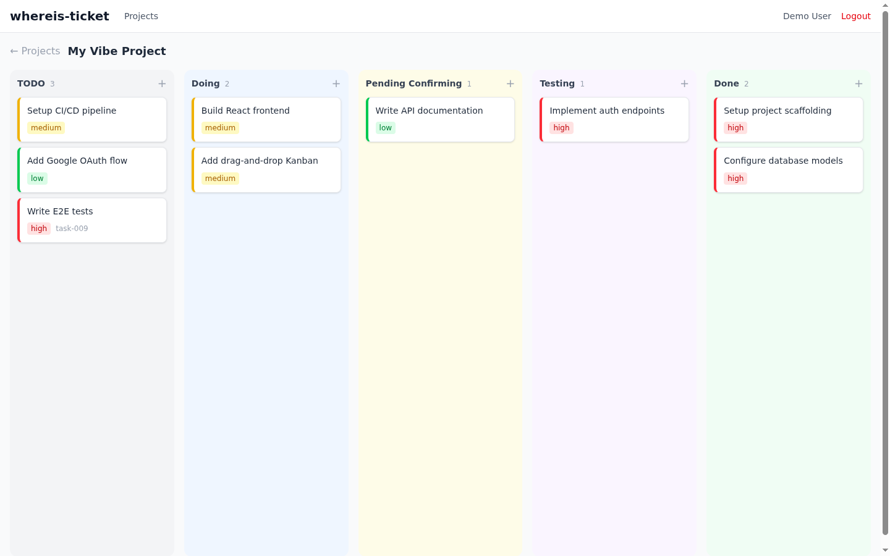

### Ticket Detail & Comments
Timestamped comment thread with both human and agent entries. Status changes auto-generate audit trail comments.

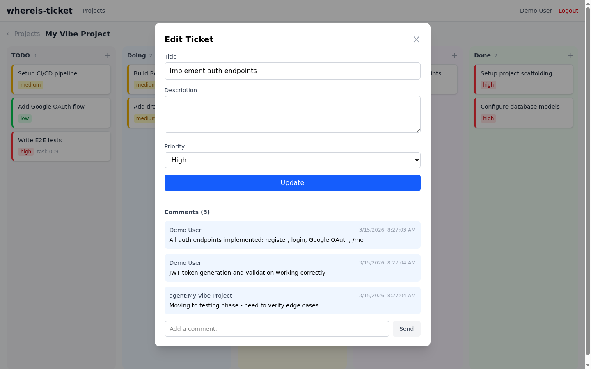

### User Avatar & Dropdown
Clickable avatar with profile edit, admin link (super_admin only), dark mode toggle, and logout.

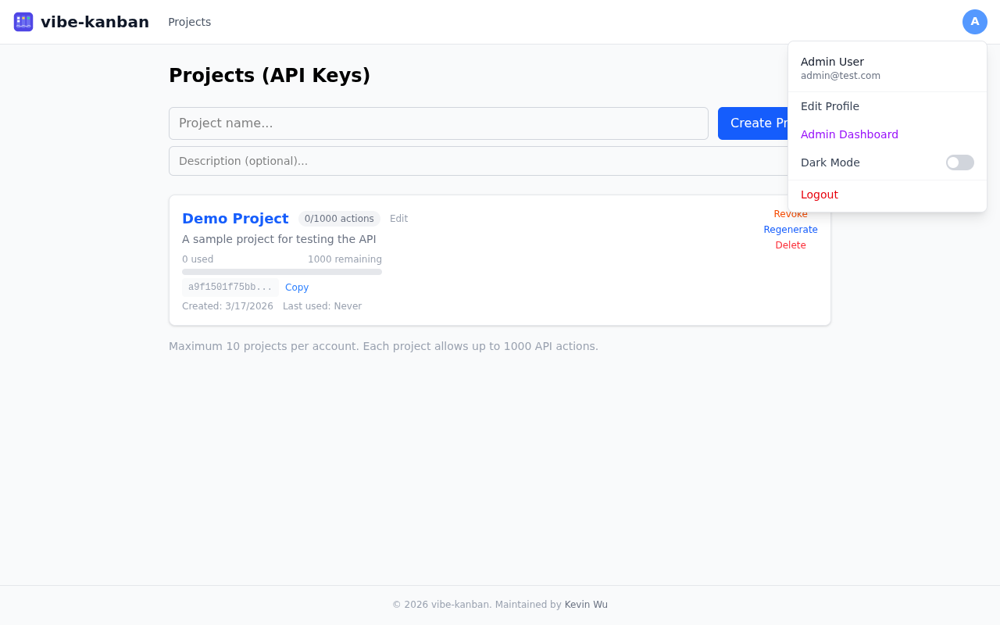

### Edit Profile
Update display name and change password with "last changed" timestamp.

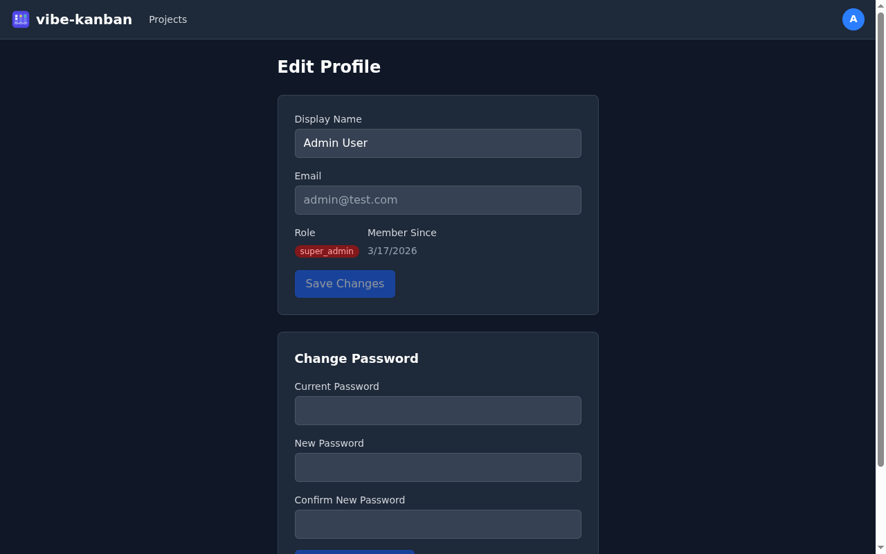

### Dark Mode
Toggle dark mode from the avatar dropdown. Preference persists across sessions via localStorage.

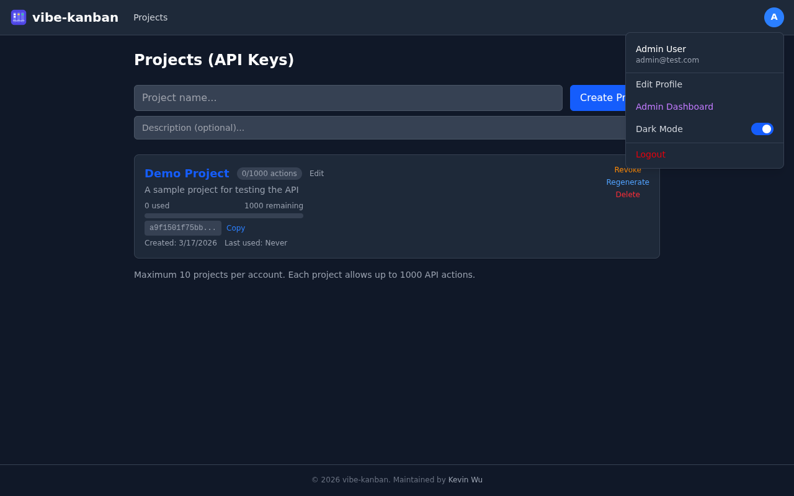

### Admin Dashboard
Super admin view with platform-wide stats, user suspend/unsuspend, and project revoke/regenerate actions.

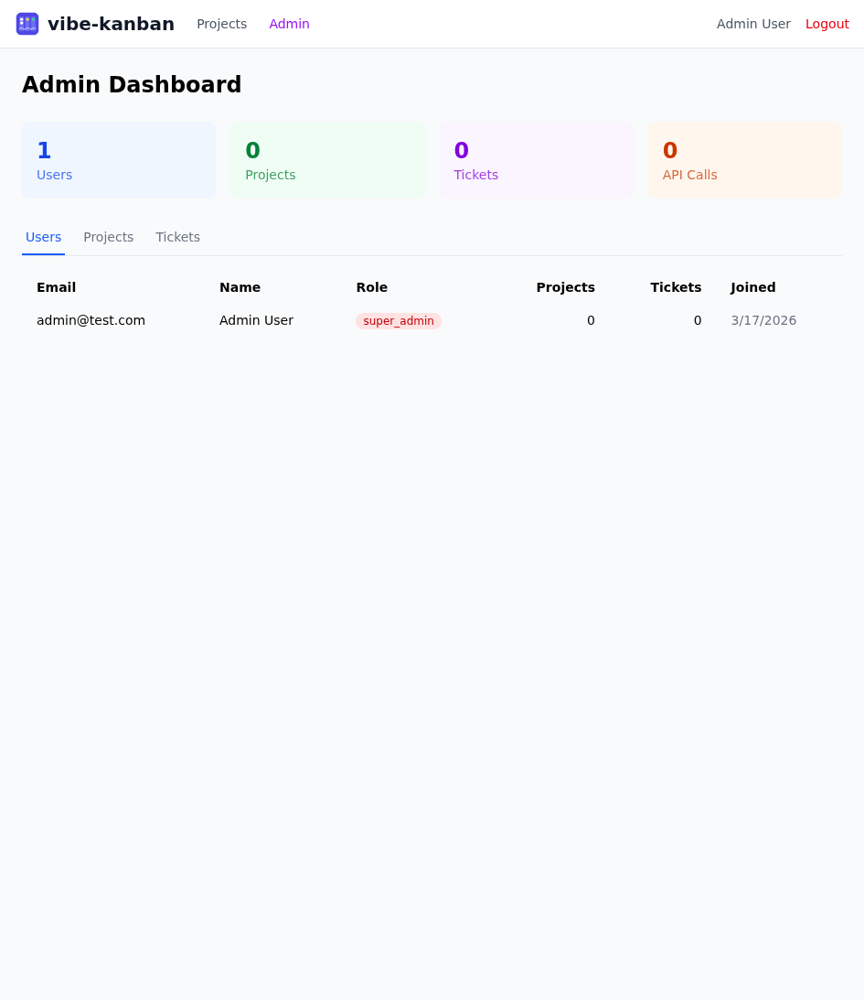

## Features

- **5-Column Kanban** — TODO, Doing, Pending Confirming, Testing, Done
- **Dual Auth** — Email/password registration + Google OAuth
- **Email Verification** — 6-digit code + click-to-verify link; unverified users limited to 1 project (trial)
- **Forgot & Reset Password** — Email-based password reset (Resend or SMTP)
- **Welcome Email** — Sent on new user registration (Google OAuth auto-verified)
- **Change Password** — Self-service password change in profile with last-updated timestamp
- **API Keys** — Up to 10 projects per verified account (1 for unverified), each with 1000 API actions
- **Project Descriptions** — Optional description field per project
- **API Key Actions** — Revoke, regenerate, and edit API keys (both user and admin)
- **External Agent API** — `X-API-Key` authenticated endpoints for agents to create, move, and comment on tickets
- **Drag & Drop** — Move tickets between columns in the web UI
- **Audit Trail** — Every status transition auto-generates a timestamped comment
- **Comments** — Both humans and agents can leave comments on tickets
- **Quota Management** — Track API usage per project with `last_used_at` timestamps (GET requests are free)
- **User Profile** — Edit display name, view role and member-since date
- **User Avatar** — Circular avatar from Google OAuth photo or generated initial letter
- **Dark Mode** — Toggle from avatar dropdown, persisted to localStorage, supports system preference
- **Super Admin** — First registered user gets `super_admin` role with full admin dashboard
- **Admin Actions** — Suspend/unsuspend users, revoke/regenerate API keys
- **Admin Dashboard** — View all users, projects, and tickets across the platform
- **PostgreSQL Support** — Production-ready with `asyncpg` driver (SQLite for development)
- **Railway Deploy** — One-click deployment with `railway.toml` configuration
- **Docker Ready** — Single-container deployment with multi-stage build

## Architecture

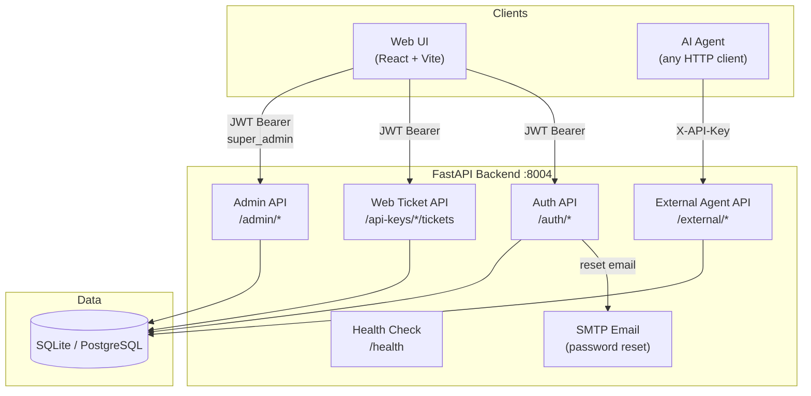

### Data Model

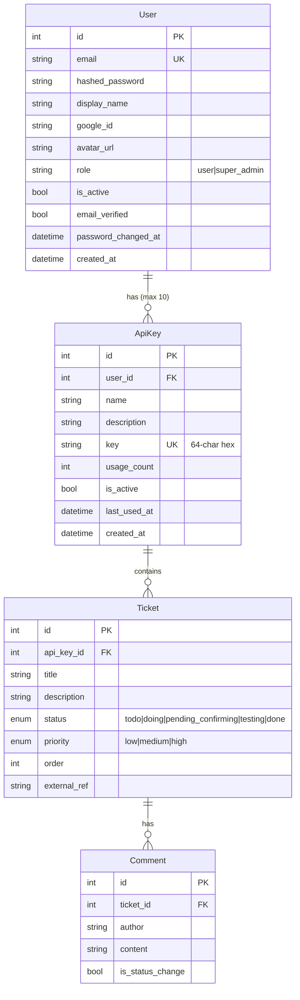

### Project Structure

```
backend/
  app/
    core/        # config, database, security (JWT + API key auth), email (SMTP)
    models/      # User, ApiKey, Ticket, Comment (SQLAlchemy async)
    schemas/     # Pydantic request/response models
    api/
      auth.py       # register, login, Google OAuth, forgot/reset/change password
      api_keys.py   # CRUD + revoke/regenerate for projects (max 10 per account)
      tickets.py    # CRUD + move (JWT auth, web UI)
      external.py   # Agent API (X-API-Key auth, quota-enforced)
      admin.py      # Admin API (super_admin only, suspend/unsuspend, revoke/regen)

frontend/
  src/
    components/  # KanbanBoard, KanbanColumn, TicketCard, TicketModal, UserAvatar, Layout
    contexts/    # AuthContext (JWT state), ThemeContext (dark mode)
    pages/       # Login, Register, ForgotPassword, ResetPassword, Settings, Board, Profile, Admin
    api/         # Axios client with auth interceptor

e2e/
  test_e2e.py              # API-level E2E tests (2 scenarios)
  playwright_e2e_steps.md  # Playwright MCP browser test guide
```

## Quick Start

### Option A: Docker (recommended)

```bash
git clone https://github.com/osisdie/vibe-kanban.git
cd vibe-kanban

# Create .env
cp .env.example .env
# IMPORTANT: Change JWT_SECRET_KEY to a random value
#   openssl rand -hex 32

# Build and run
docker compose up --build
```

Open **http://localhost:8004** — both API and UI are served from a single container.

### Option B: Local development

**Prerequisites:** Python 3.10+, Node.js 18+

```bash
git clone https://github.com/osisdie/vibe-kanban.git
cd vibe-kanban

# Create .env from example
cp .env.example .env

# Backend
python -m venv .venv
source .venv/bin/activate
pip install -r backend/requirements.txt

# Frontend
cd frontend && npm install && cd ..
```

```bash
# Terminal 1 — Backend (auto-creates SQLite DB on first run)
source .venv/bin/activate
cd backend && uvicorn app.main:app --reload --port 8004

# Terminal 2 — Frontend
cd frontend && npm run dev
```

Open **http://localhost:5177**

> Ports `8004` / `5177` are chosen to avoid conflicts with common dev servers. Change them in `.env`, `vite.config.ts`, and `Makefile` if needed.

## How It Works (Vibe Coding Workflow)

1. **Create a project** in the web UI → copy the API key
2. **Agent syncs TODO list** at session start:
   ```
   POST /api/v1/external/tickets  {"title": "Implement auth", "external_ref": "task-001"}
   ```
3. **Agent updates status** as it works:
   ```
   PATCH /api/v1/external/tickets/{id}/move  {"status": "doing"}
   ```
4. **Agent reports blockers** (missing credentials, needs approval, etc.):
   ```
   PATCH /api/v1/external/tickets/{id}/move  {"status": "pending_confirming"}
   POST  /api/v1/external/tickets/{id}/comments  {"content": "Need DB credentials"}
   ```
5. **Agent re-reads the board** if it loses context:
   ```
   GET /api/v1/external/tickets
   ```
6. **Humans can also** add/edit/move tickets directly in the web UI

## External Agent API

Authenticate with `X-API-Key` header. Only mutating requests (POST/PUT/PATCH/DELETE) count toward the 1000-action quota.

### Create a ticket

```bash
curl -X POST http://localhost:8004/api/v1/external/tickets \
  -H "X-API-Key: YOUR_KEY" \
  -H "Content-Type: application/json" \
  -d '{"title": "Implement auth module", "priority": "high", "external_ref": "task-001"}'
```

### Move a ticket

```bash
curl -X PATCH http://localhost:8004/api/v1/external/tickets/1/move \
  -H "X-API-Key: YOUR_KEY" \
  -H "Content-Type: application/json" \
  -d '{"status": "doing"}'
```

### Add a comment

```bash
curl -X POST http://localhost:8004/api/v1/external/tickets/1/comments \
  -H "X-API-Key: YOUR_KEY" \
  -H "Content-Type: application/json" \
  -d '{"content": "Blocked: waiting for DB credentials"}'
```

### List all tickets

```bash
curl http://localhost:8004/api/v1/external/tickets \
  -H "X-API-Key: YOUR_KEY"
```

### Check quota

```bash
curl http://localhost:8004/api/v1/external/usage \
  -H "X-API-Key: YOUR_KEY"
# {"name": "My Project", "usage_count": 42, "remaining": 958}
```

### Ticket statuses

| Status | Description |
|---|---|
| `todo` | Not started |
| `doing` | Currently in progress |
| `pending_confirming` | Blocked — waiting for approval, credentials, plan confirmation, etc. |
| `testing` | Implementation complete, under test |
| `done` | Finished |

## Deployment

### Docker (production)

The Dockerfile uses a multi-stage build: Node builds the React frontend, then Python serves both the API and static files from a single container.

```bash
# Build
docker build -t vibe-kanban .

# Run
docker run -d \
  -p 8004:8004 \
  -e JWT_SECRET_KEY=$(openssl rand -hex 32) \
  -e FRONTEND_URL=https://your-domain.com \
  -v kanban-data:/app/backend/data \
  vibe-kanban
```

Or with docker compose:

```bash
docker compose up -d
```

### Railway (recommended for quick deploy)

> **Important:** Railway containers are ephemeral — SQLite data is lost on every redeploy. You **must** use Railway's managed PostgreSQL.

1. Connect your GitHub repo in Railway dashboard
2. **Add Service > PostgreSQL** — this creates a managed, persistent database
3. Set the `DATABASE_URL` environment variable on your app service:
   ```
   postgresql+asyncpg://${{Postgres.PGUSER}}:${{Postgres.PGPASSWORD}}@${{Postgres.PGHOST}}:${{Postgres.PGPORT}}/${{Postgres.PGDATABASE}}
   ```
4. Set `JWT_SECRET_KEY` to a strong random value
5. Set `FRONTEND_URL` to your Railway public URL (e.g. `https://your-app.up.railway.app`)
6. Set SMTP variables for password reset emails (see Environment Variables below)
7. Deploy — the first registered user automatically becomes `super_admin`

Data safety: PostgreSQL data lives in Railway's managed storage, completely independent of app container lifecycle. Redeploys, rollbacks, and scaling do not affect your data.

### Other cloud platforms

| Platform | Difficulty | Notes |
|----------|-----------|-------|
| **Render** | Easy | Connect GitHub repo, add managed PostgreSQL. |
| **Fly.io** | Medium | `fly launch` with Dockerfile. Global edge deployment. |
| **Coolify** (self-hosted) | Medium | Full control on your own VPS. Built-in auto-HTTPS. |
| **VPS + Caddy** | Advanced | Most flexible. Caddy provides automatic HTTPS via Let's Encrypt. |

### Production checklist

- [ ] Change `JWT_SECRET_KEY` to a strong random value (`openssl rand -hex 32`)
- [ ] Set `FRONTEND_URL` to your actual domain (for CORS)
- [ ] Configure SMTP variables for password reset emails
- [ ] Consider PostgreSQL for multi-user usage (change `DATABASE_URL`)
- [ ] Set up HTTPS via reverse proxy (Caddy, nginx, or platform-managed)
- [ ] Set up backups for the database

## Environment Variables

| Variable | Default | Required | Description |
|---|---|---|---|
| `DATABASE_URL` | `sqlite+aiosqlite:///./vibe_kanban.db` | No | Database connection string |
| `JWT_SECRET_KEY` | `change-me-to-a-random-secret` | **Yes** | JWT signing secret — **must change in production** |
| `JWT_ALGORITHM` | `HS256` | No | JWT algorithm |
| `JWT_EXPIRE_MINUTES` | `1440` | No | Token expiry (default 24h) |
| `GOOGLE_CLIENT_ID` | _(empty)_ | No | Google OAuth client ID (optional) |
| `GOOGLE_CLIENT_SECRET` | _(empty)_ | No | Google OAuth client secret (optional) |
| `GOOGLE_REDIRECT_URI` | `http://localhost:8004/api/v1/auth/google/callback` | No | OAuth redirect URL |
| `EMAIL_PROVIDER` | `smtp` | No | Email provider: `smtp` or `resend` |
| `SMTP_HOST` | _(empty)_ | No | SMTP server hostname (e.g. `smtp.gmail.com`) |
| `SMTP_PORT` | `587` | No | SMTP port (587 for TLS, 465 for SSL) |
| `SMTP_USER` | _(empty)_ | No | SMTP username / sender email |
| `SMTP_APP_PASSWORD` | _(empty)_ | No | SMTP app password (for Gmail: [App Passwords](https://myaccount.google.com/apppasswords)) |
| `RESEND_API_KEY` | _(empty)_ | No | Resend API key (recommended for PaaS like Railway) |
| `RESEND_FROM_EMAIL` | _(empty)_ | No | Resend sender email (must be from a verified domain) |
| `FRONTEND_URL` | `http://localhost:5177` | No | Frontend URL for CORS and OAuth redirects |
| `API_V1_PREFIX` | `/api/v1` | No | API version prefix |

## Running E2E Tests

```bash
# Start the backend, then run tests
source .venv/bin/activate
cd backend && uvicorn app.main:app --port 8004 &
sleep 3 && python ../e2e/test_e2e.py
```

Tests cover:
1. **Single task lifecycle** — create → todo → doing → testing → done + audit trail verification
2. **Multi-task workflow** — 3 tasks with interleaved transitions, comments, blockers, and final state assertion

## CI / Pre-commit

### Pre-commit

```bash
pip install pre-commit
pre-commit install
```

- **Ruff** — Python linting + formatting (backend)
- **TypeScript** — type checking (frontend)
- **General** — trailing whitespace, YAML/JSON validation, large file check

### CI

- **GitHub Actions** (`.github/workflows/ci.yml`) — backend lint+test, frontend typecheck+build
- **GitLab CI** (`.gitlab-ci.yml`) — equivalent `lint → test → build` stages

## Contributing

Contributions are welcome! Please open an issue first to discuss what you'd like to change.

```bash
# Development setup
pip install pre-commit && pre-commit install
```

## License

MIT

